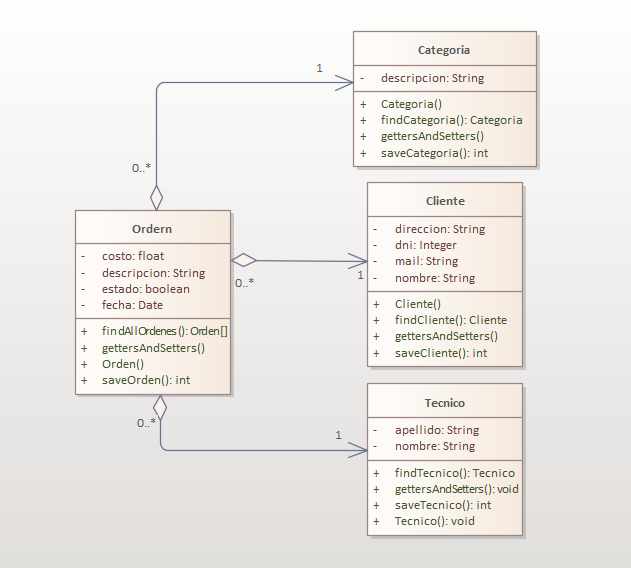
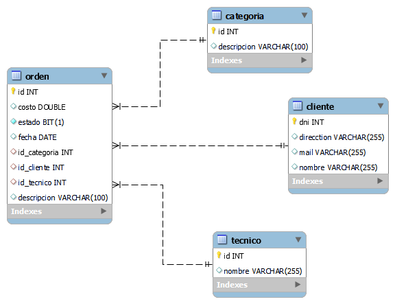

# Java-Intermedio-UTN-TPFinal
#### TP final para Java Intermedio de UTN

## Requerimientos del TP:
[PDF de los requerimientos](extra/Trabajo-Práctico-Java-UTN.pdf)

## Diagrama de clases del TP:

## Diagrama DER del TP (script sql en la carpeta "extra"):

## Ejemplo de uso con url en un navagador o Postman:

### 1- Cargar orden y si no existe el Cliente con el dni ingresado, crearlo:

http://localhost:8080/orden/descripcionOrden/150.5/false/1/1/11111115/nombreCliente/direccionCliente/mail@cliente

### 2- Listar ordenes entre 2 fechas (el codigo crea ordenes con la fecha actual, asique poner fechas anteriores y posteriores al dia en que se ingresan):

http://localhost:8080/ordenes/27-11-2023/29-11-2023

